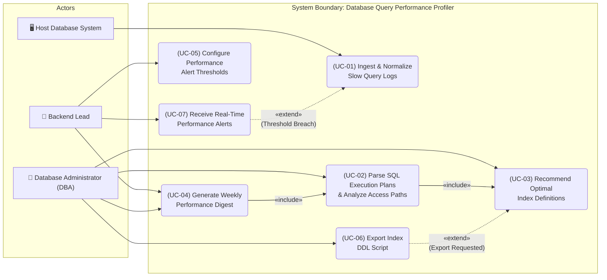
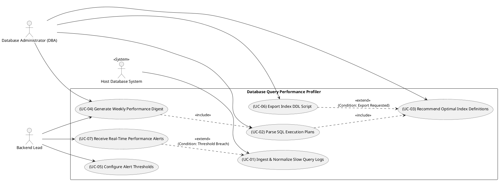

# UML Use-Case Diagram Specification - Database Query Performance Profiler

**Course:** PES University - Dept. of CSE  
**Lab:** Lab 1: Requirements Engineering & UML Use-Case Modelling  
**Problem Statement #44:** Developer Tools & IT Operations - Database Query Performance Profiler  

---

## 1. Actors & System Boundaries

### Actors
1. **Database Administrator (DBA) [Primary Actor]**
   - Responsible for database schema management, index creation, storage tuning, and overall database health.
   - Primary goals: Identify missing indexes, eliminate table scan overhead, and export DDL migration scripts.
2. **Backend Lead [Primary Actor]**
   - Responsible for application query efficiency, API response latencies, and service performance SLA compliance.
   - Primary goals: Monitor slow query trends, set performance alert thresholds, and receive weekly optimization digests.
3. **Host Database / Log Collector [Secondary System Actor]**
   - External database engines (PostgreSQL, MySQL) emitting slow query logs (`pg_stat_statements`, `slow_query_log`) and execution plans (`EXPLAIN`).

### System Boundary
- **System:** `Database Query Performance Profiler`

---

## 2. Mandatory Relationships Specification

### Includes (`«include»`)
1. **`UC-02` (Parse SQL Execution Plans) «include» `UC-03` (Recommend Optimal Index Definitions)**
   - **Rationale:** Parsing an EXPLAIN plan unconditionally triggers the automatic analysis and calculation of missing index column candidates.
2. **`UC-04` (Generate Weekly Performance Digest) «include» `UC-02` (Parse SQL Execution Plans)**
   - **Rationale:** Compiling the weekly performance digest unconditionally requires retrieving and parsing the execution plans of the top slow queries accumulated over the 7-day period.

### Extends (`«extend»`)
1. **`UC-07` (Receive Real-Time Performance Alerts) «extend» `UC-01` (Ingest & Normalize Slow Query Logs)**
   - **Extension Point:** `Threshold Breach`
   - **Condition:** Executed when an ingested query log record exceeds configured runtime or scan count alert thresholds (e.g., query duration > 500ms).
2. **`UC-06` (Export Index DDL Script) «extend» `UC-03` (Recommend Optimal Index Definitions)**
   - **Extension Point:** `Export Requested`
   - **Condition:** Executed when a DBA or Backend Lead explicitly chooses to export/copy the generated `CREATE INDEX` DDL statement for schema migration.

---

## 3. Mermaid UML Use-Case Diagram



---

## 4. PlantUML Use-Case Specification



---

## 5. ASCII System Representation

```
+-----------------------------------------------------------------------------------------------+
|                        DATABASE QUERY PERFORMANCE PROFILER SYSTEM                              |
|                                                                                               |
|   +-------------------+                                                                       |
|   |  Host DB System   | ---> [ (UC-01) Ingest & Normalize Slow Query Logs ]                       |
|   +-------------------+                                 ^                                     |
|                                                         : <<extend>> (Threshold Breach)       |
|                                                         :                                     |
|                                         [ (UC-07) Receive Real-Time Alerts ] <--- [Backend Lead]
|                                                                                      ^        |
|                                                                                      |        |
|   +---------------------+               [ (UC-05) Configure Alert Thresholds ] ------+        |
|   | Database Admin (DBA)|                                                            |        |
|   +---------------------+               [ (UC-04) Generate Weekly Digest ] ----------+        |
|          |                                              |                                     |
|          +----------------------------------------------+                                     |
|          |                                              | «include»                           |
|          v                                              v                                     |
|   [ (UC-02) Parse SQL Execution Plans ] ---------------------------------+                    |
|          |                                                               |                    |
|          | «include»                                                     |                    |
|          v                                                               |                    |
|   [ (UC-03) Recommend Optimal Index Definitions ] <----------------------+                    |
|          ^                                                                                    |
|          : <<extend>> (Export Requested)                                                      |
|          :                                                                                    |
|   [ (UC-06) Export Index DDL Script ] -----------------------------> [Database Admin (DBA)]   |
+-----------------------------------------------------------------------------------------------+
```
